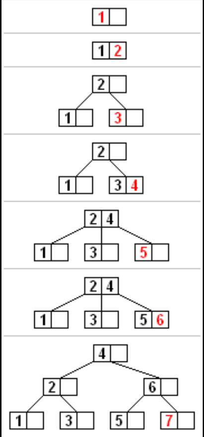

[:car:...](README.md)

# Chapter10 B-Tree
> 给一串数据，挨个插到树上，每步一图，挨个删除

* 平衡的m路查找树
* m阶B树
   1. 根至少两个孩子
   2. 除根和外部节点外，每个节点至少有[m/2]个孩子
   3. 所有外部节点因在同一层
   > 外部结点[不统一，可认为叶子的null指针]
* 插入
  1. 高尔顿板似的找到位置
  2. 如果节点拥有的元素数量小于最大值，那么有空间容纳新的元素。将新元素插入到这一节点，且保持节点中元素有序。否则的话这一节点已经满了，将它平均地分裂成两个节点：
     1.  从该节点的原有元素和新的元素中选择出中位数
     2. 小于这一中位数的元素放入左边节点，大于这一中位数的元素放入右边节点，中位数作为分隔值。
     3. 分隔值被插入到父节点中，这可能会造成父节点分裂，分裂父节点时可能又会使它的父节点分裂，以此类推。如果没有父节点（这一节点是根节点），就创建一个新的根节点（增加了树的高度）。

