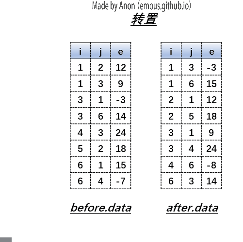
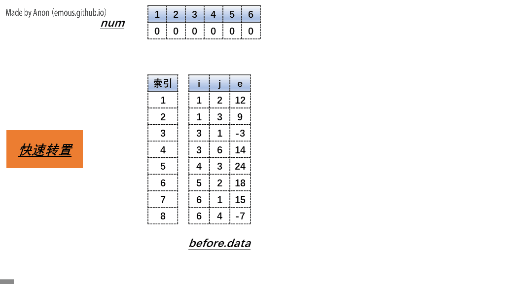

[:car:...](README.md)

# Chapter2 Arrays
- [基本概念](#基本概念)
- [数组应用](#数组应用)
  - [多项式(Polynomial)](#多项式polynomial)
    - [多项式的表示](#多项式的表示)
    - [多项式加法 It's make no sense.](#多项式加法-its-make-no-sense)
  - [稀疏矩阵(Sparse Matrices)](#稀疏矩阵sparse-matrices)
    - [三元组表示稀疏矩阵](#三元组表示稀疏矩阵)
    - [稀疏矩阵转置](#稀疏矩阵转置)
  - [字符串模式匹配(KMP算法)](#字符串模式匹配kmp算法)
    - [Brute-Force算法](#brute-force算法)
    - [KMP算法](#kmp算法)

## 基本概念
```cpp
int arr[n];
int arr = new int[n];
```
1. arr指数组的第0个元素的指针
2. `arr[i] = *(arr+i)`

## 数组应用

### 多项式(Polynomial)

#### 多项式的表示
1. 每一项
```cpp
class Term
{
  friend Polynomial;
private:
  float coef;
  int exp;
};
```

2. 总的
```cpp
class Polynomial
{
private:
  Term* termArray;
  int capacity;
  int terms;
public:
  Polynomial();
  void AddTerm(Exponent e, Coefficient c);
  Polynomial Add(Polynomial poly);
  Polynomial Mult(Polynomial poly);
  float Eval(float f);//计算在x取f时多项式的值
}
```
>* eg: 2x<sup>1000</sup> + 1
>
>| coef | exp  |
>|:----:|:----:|
>|  2   | 1000 |
>|  1   |  0   |
>| ...  | ...  |
>* 总结：
> 对于稀疏多项式节省储存空间，对于满的则比双数组法要多一倍

#### 多项式加法 It's make no sense.

### 稀疏矩阵(Sparse Matrices)
#### 三元组表示稀疏矩阵
> Matrices
>| arr | 0  | 1  | 2  | 3  | 4 |  5  |
>|:---:|:--:|:--:|:--:|:--:|:-:|:---:|
>|  0  | 15 | 0  | 0  | 22 | 0 | -15 |
>|  1  | 0  | 11 | 3  | 0  | 0 |  0  |
>|  2  | 0  | 0  | 0  | -6 | 0 |  0  |
>|  3  | 0  | 0  | 0  | 0  | 0 |  0  |
>|  4  | 91 | 0  | 0  | 0  | 0 |  0  |
>|  5  | 0  | 0  | 28 | 0  | 0 |  0  |
>
> Triple
>
>| smArray | row | col | value |
>|:-------:|:---:|:---:|:-----:|
>|   [0]   |  0  |  0  |  15   |
>|   [1]   |  0  |  3  |  22   |
>|   [2]   |  0  |  5  |  -15  |
>|   [3]   |  1  |  1  |  11   |
>|   [4]   |  1  |  2  |   3   |
>|   [5]   |  2  |  3  |  -6   |
>|   [6]   |  4  |  0  |  91   |
>|   [7]   |  5  |  2  |  28   |
ADT
```cpp
class SparseMatrix
{
public:
  SparseMatrix(int r, int c, int t);
  SparseMatrix Transpose();
  SparseMatrix Add(SparseMatrix b);
  SparseMatrix Multiply(SparseMatrix b);
};

class MatrixTerm
{
friend class SparseMatrix;
private:
  int rows, cols, terms, capacity;
  MatrixTerm* smArray;
};
```

#### 稀疏矩阵转置
> 转置是指对表示矩阵的三元组进行转置而非二维矩阵本身
> problem 直接对三元组的i，j进行互换后数组顺序不对
1. 普通转置: 按列遍历，放入新三元组中【由于本身就是按行序排列，所以刚好】


2. 快速转置: 三次遍历
   1. 第一次按列遍历原三元组，计算每一列多少元素, 记录在num[col]中
   2. 第二次遍历num[col], 计算每一列的起始位置，记录在cpot[col]中
   3. 第三次按列遍历原三元组，将每个元素放在新三元组中，每放一次i列，更新一下cpot[i]
  
    在两次遍历后
      | col | num[col] | cpot[col] |
      |:---:|:--------:|:---------:|
      |  1  |    2     |     1     |
      |  2  |    2     |     3     |
      |  3  |    2     |     5     |
      |  4  |    1     |     7     |
      |  5  |    0     |     8     |
      |  6  |    1     |     8     |
      |  7  |    0     |     9     |
      之后每次读表后，cpot都要更新


### 字符串模式匹配(KMP算法)

#### Brute-Force算法
对主串从头遍历与模式串进行匹配，错误则从主串下一个字符继续

#### KMP算法
1. Partial Match Table : 部分匹配表，当前位置前缀与后缀的最大共同长度
2. next数组：PMT右移一位的产物（方便代码而已）
> *  PMT，next数组只取决于模式串，与主串无关
> * next[i]表示pat数组前i个元素(注意next[i]是next数组的第i+1个元素)的最大共同长度(即为PMT[i-1])
> * next[0]可以自定义，如自定义为一个负数以做为开始的标识
> * 模式匹配时模式串在第j个出错，则j=next[j],这就是此算法灵魂
3. 失配函数： 类似于next数组<br>
f(j) = k(p<sub>0</sub>...p<sub>k</sub>与后缀匹配)<br>
f(j) = -1(没东西匹配时)<br>

4. eg

| pat | j | PMT | next | j  |
|:---:|:-:|:---:|:----:|:--:|
|  a  | 0 |  0  |  -1  | -1 |
|  b  | 1 |  0  |  0   | -1 |
|  c  | 2 |  0  |  0   | -1 |
|  a  | 3 |  1  |  0   | 0  |
|  b  | 4 |  2  |  1   | 1  |
|  c  | 5 |  3  |  2   | 2  |
|  a  | 6 |  4  |  3   | 3  |
|  c  | 7 |  0  |  4   | -1 |
|  a  | 8 |  1  |  0   | 0  |
|  b  | 9 |  2  |  1   | 1  |

code
KMP
```cpp
int KMP(char * t, char * p)
{
	int i = 0;
	int j = 0;

	while (i < strlen(t) && j < strlen(p))
	{
		if (j == -1 || t[i] == p[j])
		{
			i++;
   		j++;
		}
	 	else
   		j = next[j];
 	}

  if (j == strlen(p))
   return i - j;//主串开始匹配的位置
  else
   return -1;
}
```

求next
```cpp
void getNext(char * p, int * next)
{
	next[0] = -1;
	int i = 0, j = -1;

	while (i < strlen(p))
	{
		if (j == -1 || p[i] == p[j])
		{
			++i;
			++j;
			next[i] = j;
		}
		else
			j = next[j];//也利用了之前信息，前面j个不用在匹配一定是对的
	}
}
```