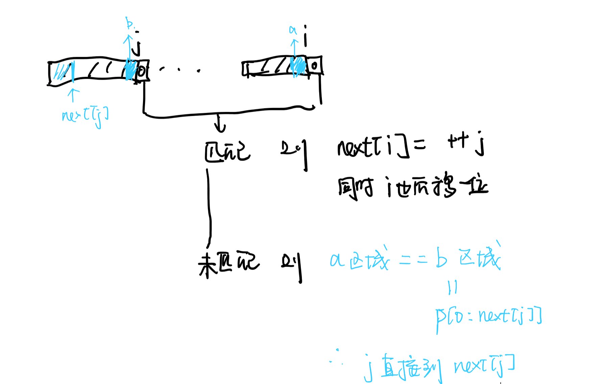

[:car:...](README.md)

# Chapter2 Arrays

> - 只考 kmp
> - 失败函数计算
> - 纸上模拟 kmp 算法过程
> - 证明 kmp 的正确性

- [基本概念](#基本概念)
- [数组应用](#数组应用)
  - [多项式(Polynomial)](#多项式polynomial)
    - [多项式的表示](#多项式的表示)
    - [多项式加法 It's make no sense.](#多项式加法-its-make-no-sense)
  - [稀疏矩阵(Sparse Matrices)](#稀疏矩阵sparse-matrices)
    - [三元组表示稀疏矩阵](#三元组表示稀疏矩阵)
    - [稀疏矩阵转置](#稀疏矩阵转置)
  - [字符串模式匹配(KMP 算法)](#字符串模式匹配kmp-算法)
    - [Brute-Force 算法](#brute-force-算法)
    - [KMP 算法](#kmp-算法)

## 基本概念

```cpp
int arr[n];
int arr = new int[n];
```

1. arr 指数组的第 0 个元素的指针
2. `arr[i] = *(arr+i)`

## 数组应用

### 多项式(Polynomial)

#### 多项式的表示

1. 每一项

```cpp
class Term
{
  friend Polynomial;
private:
  float coef;
  int exp;
};
```

2. 总的

```cpp
class Polynomial
{
private:
  Term* termArray;
  int capacity;
  int terms;
public:
  Polynomial();
  void AddTerm(Exponent e, Coefficient c);
  Polynomial Add(Polynomial poly);
  Polynomial Mult(Polynomial poly);
  float Eval(float f);//计算在x取f时多项式的值
}
```

> - eg: 2x<sup>1000</sup> + 1
>
> | coef | exp  |
> | :--: | :--: |
> |  2   | 1000 |
> |  1   |  0   |
> | ...  | ...  |
>
> - 总结：
>   对于稀疏多项式节省储存空间，对于满的则比双数组法要多一倍

#### 多项式加法 It's make no sense.

### 稀疏矩阵(Sparse Matrices)

#### 三元组表示稀疏矩阵

> Matrices
>
> | arr |  0  |  1  |  2  |  3  |  4  |  5  |
> | :-: | :-: | :-: | :-: | :-: | :-: | :-: |
> |  0  | 15  |  0  |  0  | 22  |  0  | -15 |
> |  1  |  0  | 11  |  3  |  0  |  0  |  0  |
> |  2  |  0  |  0  |  0  | -6  |  0  |  0  |
> |  3  |  0  |  0  |  0  |  0  |  0  |  0  |
> |  4  | 91  |  0  |  0  |  0  |  0  |  0  |
> |  5  |  0  |  0  | 28  |  0  |  0  |  0  |
>
> Triple
>
> | smArray | row | col | value |
> | :-----: | :-: | :-: | :---: |
> |   [0]   |  0  |  0  |  15   |
> |   [1]   |  0  |  3  |  22   |
> |   [2]   |  0  |  5  |  -15  |
> |   [3]   |  1  |  1  |  11   |
> |   [4]   |  1  |  2  |   3   |
> |   [5]   |  2  |  3  |  -6   |
> |   [6]   |  4  |  0  |  91   |
> |   [7]   |  5  |  2  |  28   |
>
> ADT

```cpp
class SparseMatrix
{
public:
  SparseMatrix(int r, int c, int t);
  SparseMatrix Transpose();
  SparseMatrix Add(SparseMatrix b);
  SparseMatrix Multiply(SparseMatrix b);
};

class MatrixTerm
{
friend class SparseMatrix;
private:
  int rows, cols, terms, capacity;
  MatrixTerm* smArray;
};
```

#### 稀疏矩阵转置

> 转置是指对表示矩阵的三元组进行转置而非二维矩阵本身
> problem 直接对三元组的 i，j 进行互换后数组顺序不对

1. 普通转置: 按列遍历，放入新三元组中【由于本身就是按行序排列，所以刚好】
   

2. 快速转置: 三次遍历
   1. 第一次按列遍历原三元组，计算每一列多少元素, 记录在 num[col]中
   2. 第二次遍历 num[col], 计算每一列的起始位置，记录在 cpot[col]中
   3. 第三次按列遍历原三元组，将每个元素放在新三元组中，每放一次 i 列，更新一下 cpot[i]
      
      在两次遍历后
      | col | num[col] | cpot[col] |
      |-----|----------|-----------|
      | 1 | 2 | 1 |
      | 2 | 2 | 3 |
      | 3 | 2 | 5 |
      | 4 | 1 | 7 |
      | 5 | 0 | 8 |
      | 6 | 1 | 8 |
      | 7 | 0 | 9 |
      之后每次读表后，cpot 都要更新

### 字符串模式匹配(KMP 算法)

#### Brute-Force 算法

对主串从头遍历与模式串进行匹配，错误则从主串下一个字符继续

#### KMP 算法

1. Partial Match Table : 部分匹配表，当前位置前缀与后缀的最大共同长度
2. next 数组：PMT 右移一位的产物（方便代码而已）
   > - PMT，next 数组只取决于模式串，与主串无关
   > - next[i]表示 pat 数组前 i 个元素(注意 next[i]是 next 数组的第 i+1 个元素)的最大共同长度(即为 PMT[i-1])
   > - next[0]可以自定义，如自定义为一个负数以做为开始的标识
   > - 模式匹配时模式串在第 j 个出错，则 j=next[j],这就是此算法灵魂
3. 失配函数： 类似于 next 数组<br>
   f(j) = k(p<sub>0</sub>...p<sub>k</sub>与后缀匹配)<br>
   f(j) = -1(没东西匹配时)<br>

4. 正确性证明

   > 需要证明的问题：对于形如 A B X1 X2… A B Y1 Y2… A B 的模式串，为什么可以将模式串直接移到最后一个 A B 处进行下一次匹配，而不是在中间某个 A B 处？也就是说为什么以中间某个 A B 开头进行匹配不可能成功。(注意这里为了方便只有 A B 两个字符，实际上可能是多个，并且中间的 A B 和第一个以及最后一个 A B 使可能部分重合的)。

   - 首先，一次匹配成功则必然有在 T 中的对应的位置以 A B 开头，所以从 T 中最后一个 A B 处开始进行下一次匹配，成功是可能的。(即是 KMP 算法中下一次匹配移动模式串的位置)

   - 下面证明为什么从中间某个位置的 A B 处匹配不可能成功

     - 若序列 X1 X2…与序列 Y1 Y2…不完全相同，显然在第二个 A B 串处后面不可能匹配成功

     - 若序列 X1 X2…与序列 Y1 Y2…完全相同，则显然 A B X1 X2…A B 与 A B Y1 Y2… A B 是相等的更长的前缀和后缀，这自然回到了 next 数组

5. eg

| pat |  j  | PMT | next | f(j) |
| :-: | :-: | :-: | :--: | :--: |
|  a  |  0  |  0  |  -1  |  -1  |
|  b  |  1  |  0  |  0   |  -1  |
|  c  |  2  |  0  |  0   |  -1  |
|  a  |  3  |  1  |  0   |  0   |
|  b  |  4  |  2  |  1   |  1   |
|  c  |  5  |  3  |  2   |  2   |
|  a  |  6  |  4  |  3   |  3   |
|  c  |  7  |  0  |  4   |  -1  |
|  a  |  8  |  1  |  0   |  0   |
|  b  |  9  |  2  |  1   |  1   |

> 可以看出 f(j)与 PMT 只差一个(因为 pmt 数的是个数，f(j)数的是下标)

code
KMP

```cpp
int KMP(string t, string p)
{
  int* next = getNext(p);
	int i = 0;
	int j = 0;

	while (i < t.length() && j < p.length())
	{
    // 如果j=-1，则没匹配到，母串向前一位，字串-1+1还是首位
		if (j == -1 || t[i] == p[j])
		{
			i++;
			j++;
		} else
	 	{
   		j = next[j];
	 	}
 	}

  if (j == p.length())
    return i - j;//主串开始匹配的位置
  else
    return -1;
}
```

求 next

- `i`: 考虑的字符串的最后一位索引（后缀的最后一位）
- `j`: 与后缀匹配的前缀的最后一位索引
- `next[i]`: 表示`p[0:i]`的最大公共前后缀长度


```cpp
int* getNext(string p) {
  int* next = new int(p.length());
  next[0] = -1;
  int i = 0, j = -1;

  while (i < p.length()) {
    if (j == -1 || p[i] == p[j]) {
      ++i;
      ++j;
      next[i] = j;
    } else
      j = next[j]; //也利用了之前信息，前面j个不用在匹配一定是对的
  }
  return next;
}
```
