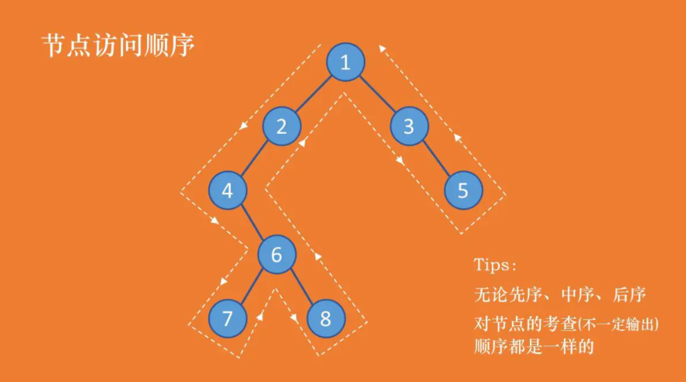
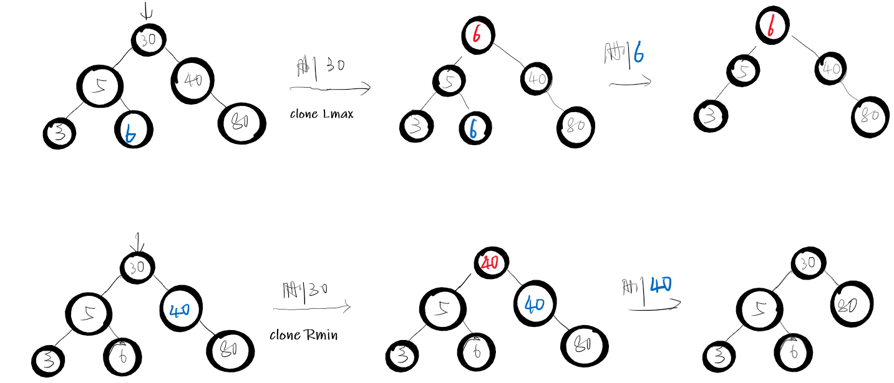
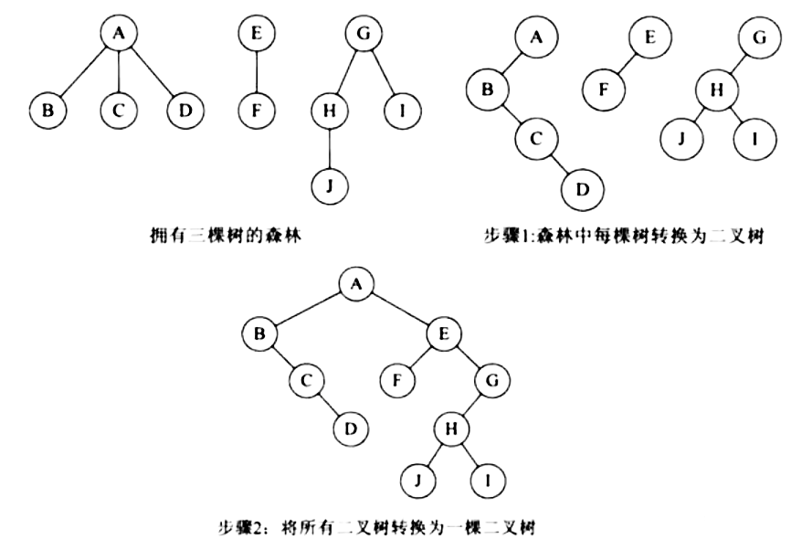

[:car:...](README.md)

# Chapter5 Tree
- [Binary Trees](#binary-trees)
  - [Traverse](#traverse)
  - [Construction](#construction)
  - [Application](#application)
- [Binary Search](#binary-search)
- [Binary Search Tree](#binary-search-tree)
  - [插入](#插入)
    - [算法](#算法)
    - [code](#code)
  - [删除](#删除)
    - [叶子节点](#叶子节点)
    - [有PL/PR的节点](#有plpr的节点)
    - [有PL和PR的节点](#有pl和pr的节点)
- [Selection Trees](#selection-trees)
  - [胜者树](#胜者树)
  - [败者树](#败者树)
- [森林](#森林)
  - [与二叉树的转换](#与二叉树的转换)
  - [对森林F遍历](#对森林f遍历)

## Binary Trees
### Traverse
> 
* Inorder: 考察到一个节点后，将其暂存，**遍历完左子树后**，再输出该节点的值，然后遍历右子树。(左根右)
  > 4,7,6,8,2,1,3,5[输出前判断其左子树遍历完没]
* Postorder: 考察到一个节点后，将其暂存，**遍历完左右子树**后，再输出该节点的值。(左右根)
  > 7,8,6,4,2,5,3,1[输出前判断左右子树遍历完没] 
* Preorder: 考察到一个节点后，即刻输出该节点的值，并继续遍历其左右子树。(根左右)
  > 1,2,4,6,7,8,3,5[见谁输出谁]

* level-order: 前三种都要栈来实现（递归也是栈），层次遍历用队列 
  > * 将根节点放入队列
  > * 之后循环执行：取出队列头元素cur,cur->left,cur->right,并依次讲孩子们放入队列
  > * 1,2,3,4,5,6,7,8
### Construction
> Nothing, just do it.

### Application
> 数节点个数等

## Binary Search
> 使用条件： 顺序排列，连续的储存空间
* 时间复杂度: <!-- $\Theta(n)$ --> 
* 空间复杂度: <!-- $\Theta(1)$ --> 
* code
  ```cpp
  int binary_search(const int arr[], int start, int end, int khey) {
  	if (start > end)
  		return -1;

  	int mid = start + (end - start) / 2;    //直接平均可能會溢位，所以用此算法
  	if (arr[mid] > khey)
  		return binary_search(arr, start, mid - 1, khey);
  	else if (arr[mid] < khey)
  		return binary_search(arr, mid + 1, end, khey);
  	else
  	    return mid;        //最後檢測相等是因為多數搜尋狀況不是大於要不就小於
  }
  ```

## Binary Search Tree
> [wiki](https://zh.wikipedia.org/wiki/%E4%BA%8C%E5%85%83%E6%90%9C%E5%B0%8B%E6%A8%B9)
> * 执行查找，插入，删除是目前最快的数据结构
> * 元素键值不重复
> * 左子树键值小于根
> * 右子树键值大于根

### 插入
#### 算法
> 在二叉搜索树b中插入节点s递归执行
> 1. 若b空树，则直接插入
> 2. 若s->data等于b的根节点数据，返回
> 3. 若小于，则插到左子树中
> 4. 若大于，则插到右子树中

#### code
```cpp
/* 当二叉查找树T中不存在关键字等于e.key的数据元素时，插入e并返回TRUE，否则返回 FALSE */
bool InsertBST(BiTree *&T, ElemType e) {
    if (!T) {
        s = new BiTNode;
        s->data = e;
        s->lchild = s->rchild = NULL;
        T = s; // 被插節点*s为新的根结点
    } else if (e.key == T->data.key)
        return false;// 关键字等于e.key的数据元素，返回錯誤
    if (e.key < T->data.key)
        InsertBST(T->lchild, e);  // 將 e 插入左子樹
    else
        InsertBST(T->rchild, e);  // 將 e 插入右子樹
    return true;
}
```

### 删除
> * 删除节点*p
> * 时间复杂度<!-- $\mathcal{o}(h)$ --> 
#### 叶子节点
* 直接删掉，令pp指向null即可
#### 有PL/PR的节点
* 直接删掉，令pp指向PL/PR即可
#### 有PL和PR的节点
* 先将此节点的左子树的最大元素或右子树的最小元素赋值给此节点（因为是最大或最小的，它的度不可能是2，如果是2，那说明它一定是中间值）
* 然后删除被克隆的节点（这个节点的度一定小于2）
 

## Selection Trees
> 一定是完全二叉树
> 对于n个选手，构造2n个节点的完全二叉树[数组实现]
### 胜者树
父节点为两个孩子中的胜者的指针

### 败者树
父节点为两个孩子中的失败者的指针

## 森林
### 与二叉树的转换
> 左孩子，右兄弟
### 对森林F遍历

* 先序遍历: 等价于先序遍历对应的树T
  > T&F:ABCDEFGHJI
* 中序遍历: 等价于中序遍历对应的树T
  > T&F:BCDAFEJHIG
* 后序遍历: 与之对应的树T无自然的对应关系[?]
  > * T: DCBFJIHGEA
  > * F: BCDAFEJHIG
  > * 森林的后序遍历与树的中序一样
* 层次遍历: 按序从左到右遍历每一层，与树T遍历结果不一定相同
  > * T: ABECFGDHJI
  > * F: ABCDEFGHIJ
