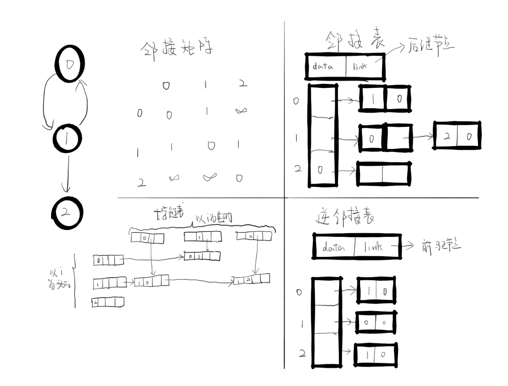
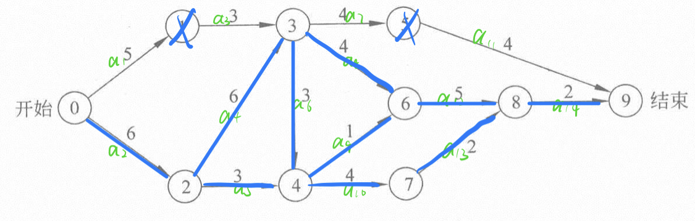

[:car:...](README.md)

# Chapter6 Graph
- [Represetations](#represetations)
  - [邻接矩阵(adjancency matrices)](#邻接矩阵adjancency-matrices)
  - [邻接表(adjancency list)](#邻接表adjancency-list)
    - [逆邻接表(inverse adjancency list)](#逆邻接表inverse-adjancency-list)
    - [十字链表](#十字链表)
  - [邻接多表(adjacency multilist)](#邻接多表adjacency-multilist)
- [基本操作](#基本操作)
  - [遍历](#遍历)
  - [插入](#插入)
  - [删除](#删除)
- [Shortest Paths](#shortest-paths)
  - [Dijkstra](#dijkstra)
- [AOE](#aoe)

## Represetations
### 邻接矩阵(adjancency matrices)
> Too easy...

### 邻接表(adjancency list)
> 只关心节点的出度,链表里的是以i指向的节点
#### 逆邻接表(inverse adjancency list)
> 只关心节点的入度，链表里的是指向i的节点

#### 十字链表 
> * 尤适用于有向图
>
> * |head|tail|行链接|列链接|
>   |:--:|:--:|:--:|:--:|
> * 行链接列表为邻接表，关心出度
> * 列链接列表为逆邻接表，关心入度


### 邻接多重表(adjacency multilist)
> * 适用于无向图，解决了空间的浪费，方便了遍历，插入，删除
> 
> * |m|v<sub>1</sub>|v<sub>2</sub>|link1|link2|
>   |:--:|:--:|:--:|:--:|:--:|
> * 每条边只有一个节点表示，但这个节点同时在两个链表里
> * m:标记是否被检查过
> * link1: 对应v<sub>1</sub>相关的边
> * ??

## 基本操作
### 遍历
> 尤指编个小程序（十字链表）

### 插入

### 删除

## Shortest Paths
### 迪杰斯特拉算法[Dijkstra](https://zh.wikipedia.org/wiki/%E6%88%B4%E5%85%8B%E6%96%AF%E7%89%B9%E6%8B%89%E7%AE%97%E6%B3%95)
> * 贪婪算法的计算过程，证明， 举例哪些情形下不好用
> * 约束条件： 没有负边
> * 以类似于广搜解决了单源任意目的地最短路径问题

* 复杂度

|              算法              |                                                        最坏时间复杂度                                                        |
|:----------------------------:|:----------------------------------------------------------------------------------------------------------------------------:|
|   使用邻接表的戴克斯特拉算法   |     <!-- $\mathcal{O}(V^2)$ -->       |
| 使用二叉堆优化的戴克斯特拉算法 | <!-- $\mathcal{O}((E+V)\log(V))$ -->  |
|使用斐波那契堆优化的戴克斯特拉算法|	<!-- $\mathcal{O} (E+V\log(V))$ --> 

* 算法
  1. 用一个数组L来标记是否为最短路径
  2. 用dist数组存储路径
  3. 每次遍历dist数组找出最短路径，标记它，并以它对未标记点做松弛操作
   
* code
```cpp
// n is the num of vertexs, v is the algorithm's start vertex
void dijkstra(int n, int v)
{
  for(int i = 0; i < n; i++)
  {
    L[i] = false;
    dist[i] = length[v][i];
  }
  //for lenght[v][v] = 0; so dist[v]=0 must be the shortest one
  L[v] = true;
  for(int i = 0; i < n-2; i++)
  {
    int u = choose(dist);//dist[u] is the shortest in dist except those mark as true 
    L[u] = true;
    for(int w = 0; w < n; w++)
    {
      if(!L[w]&&dist[u]+length[u][w]<dist[w])
      {
        dist[w] = dist[u]+length[u][w];
      }
    }
  }
}

int choose(int* dist)
{
  int k=0;
    for(int j=1;j<=n;++j)//找出距离最近的点
    {
      if(!v[j]&&(k==0||dis[j]<dis[k]))
        k=j;
    }
  return k;
}
```


## AOE
> Activity on Edge network(用边来表示活动，顶点表示事件即任务完成的标志)
> 两个表，每个事件开始的最早最迟时间

* 关键路径： 工程完成所需最短时间是最长路径的长度，最长路径叫做关键路径
* 事件i最早发生时间： 起点0到顶点i的最长路径长度
* 事件i最迟开始时间： 不延长工程持续时间的前提下，每个活动a<sub>i</sub>最迟开始时间
* 关键活动： e(i) = l(i)的活动
* 拓扑排序： 若i是j的前驱，则在这种排序里i一定在j前

### 算法
> 按拓扑顺序先计算时间的最早最迟时间，然后计算活动的最早最迟时间，从而确定关键活动

1. 向前步骤计算事件最早发生事件ee[j]
   > ee[0] = 0; ee[j] = max{ee[i]+<i,j>}

2. 向后步骤计算事件最迟发生时间le[j]
   > le[n-1] = ee[n-1]; le[j] = min{le[j]-<i,j>}

3. 计算活动的最早最迟时间
   若a<sub>i</sub>用边<k,l>表示，则

   <!-- $$ 
   e[i] = ee[k]
   $$ --> 

<div align="center"></div>

   <!-- $$
   l[i] = le[l] - a_i
   $$ --> 

<div align="center"></div>

4. 缩短工期
   > 只有缩短在所有关键路径上公用的关键活动才能缩短工期
   
5. 例子


    eg: 

  <!-- $$
  ee[4] = \max(ee[3]+3,ee[2]+3) = \max(15,9) = 15
  $$ --> 

<div align="center"></div>

  <!-- $$
  le[3] = \min(le[6]-4,le[4]-3,le[5]-4) = \min(12,12,15) = 12
  $$ --> 

<div align="center"></div>

  | i | ee[i] | le[i] |
  |:-:|:-----:|:-----:|
  | 0 |   0   |   0   |
  | 1 |   5   |   9   |
  | 2 |   6   |   6   |
  | 3 |  12   |  12   |
  | 4 |  15   |  15   |
  | 5 |  16   |  19   |
  | 6 |  16   |  16   |
  | 7 |  19   |  19   |
  | 8 |  21   |  21   |
  | 9 |  23   |  23   |

  eg: 

<!-- $$
e[3] = ee[1] = 5
$$ --> 

<div align="center"></div>

 <!-- $$
 l[1]=le[1]-a_1=9-5=4
 $$ --> 

<div align="center"></div>

  | a<sub>i</sub> |  e[i]  |  l[i]  |
  |:-------------:|:------:|:------:|
  |       1       |   0    |   4    |
  |     **2**     | **0**  | **0**  |
  |       3       |   5    |   9    |
  |     **4**     | **6**  | **6**  |
  |       5       |   6    |   12   |
  |     **6**     | **12** | **12** |
  |       7       |   12   |   15   |
  |     **8**     | **12** | **12** |
  |     **9**     | **15** | **15** |
  |    **10**     | **15** | **15** |
  |      11       |   16   |   19   |
  |    **12**     | **16** | **16** |
  |    **13**     | **19** | **19** |
  |    **14**     | **21** | **21** |

  * 关键活动： a<sub>2</sub>a<sub>4</sub>a<sub>6</sub>a<sub>8</sub>a<sub>9</sub>a<sub>10</sub>a<sub>12</sub>a<sub>13</sub>a<sub>14</sub>

  * 关键路径
     * 2-4-8-12-14
     * 2-4-6-9-12-14
     * 2-4-6-10-13-14
     
  * 加速工程： 2，4，14这三个在所有的关键路径上，所以要缩短他们才能加速工程
