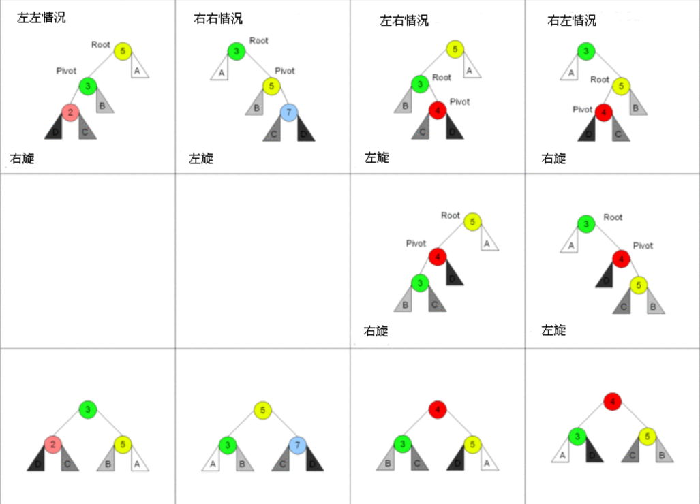

[:car:...](README.md)

# Chapter9 [AVL-Tree](https://zh.wikipedia.org/wiki/AVL%E6%A0%91)
  > 插入十二个月，画图旋转前-->旋转后

* 概念：自平衡**二叉查找树**，高度平衡树，任一节点的两颗子树的高度差不超过1
* 平衡因子：左树高-右树高
* 复杂度： 查找，插入，删除，最好最坏都是logn
* 插入的四种转换一个原则：插入是从根插入，然后像**高尔顿板**一样找到自己合适的位置，左右关系不变【因为左右关系是大小关系的反映怎么可能在重构时变化呢】
